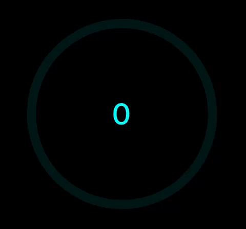

# donut-progress-react-native

A highly customisable animated donut progress chart for react native

## Installation

```sh
npm install donut-progress
```



## Usage

```js
<DonutProgress 
    color='cyan' 
    appendText="%" 
    edgeCurved 
    fontSize={30} 
    radius={100} 
    strokeWidth={10} 
    duration={1500} 
    percentage={86} 
    max={100} 
/>
```

## Contributing

See the [contributing guide](CONTRIBUTING.md) to learn how to contribute to the repository and the development workflow.

## License

MIT
